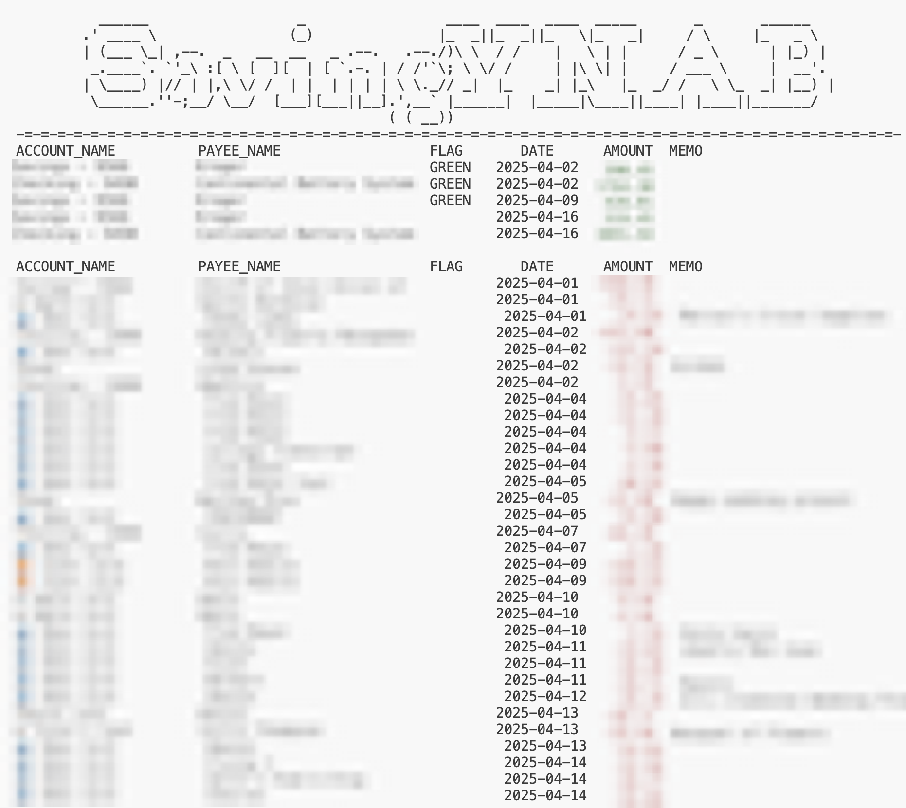

# SavingYNAB
## Features
Customizably uses YNAB data to calculate savings rate, total earnings, and total spending for any period with optional drill down detail.



This project is entirely open source and private. Currently runs exclusively in the terminal.

## Setup
1) `pip install ynab`
2) Generate a `Personal Access Token`
   1) [Sign in to the YNAB web app](https://app.ynab.com/settings) and go to the "Account Settings" page and then to the "Developer Settings" page.
   2) Under the "Personal Access Tokens" section, click "New Token", enter your password and click "Generate" to get an access token.
   3) Copy the token from the top of the screen. It is irrecoverable after refresh.
3) Provide your access token in `Run.py`
4) Adjust the following customization functions. They each take a [YNAB `TransactionDetail` object](https://github.com/ynab/ynab-sdk-python/blob/main/docs/TransactionDetail.md) and return `bool`. 
    - They determine what qualifies as a transaction, earnings, and spending.
   - Using the example code and linked documentation, adjust them to what you find appropriate.
    ```
    by_transaction_criteria
    by_earning_criteria
    by_spending_criteria
    ```
5) Execute `python3 /SavingYNAB/run.py`
6) Resize the window to fit the logo
